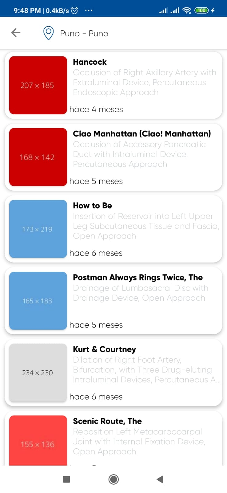
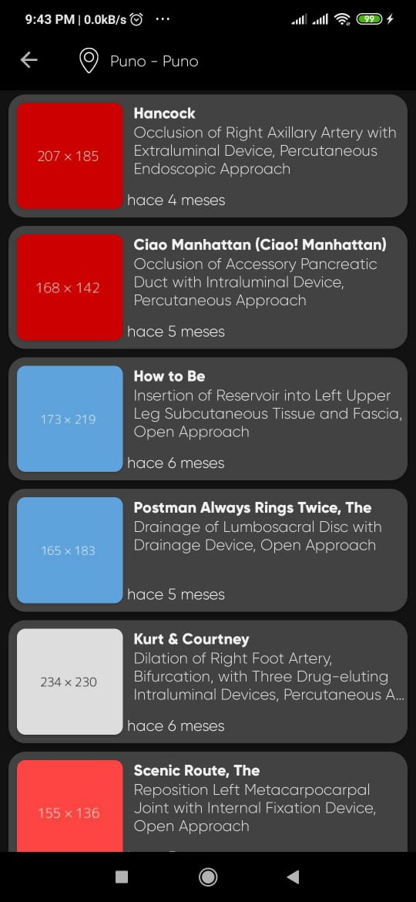
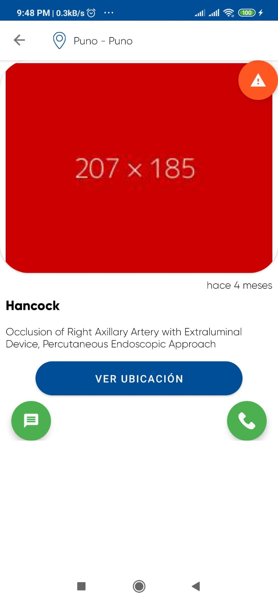
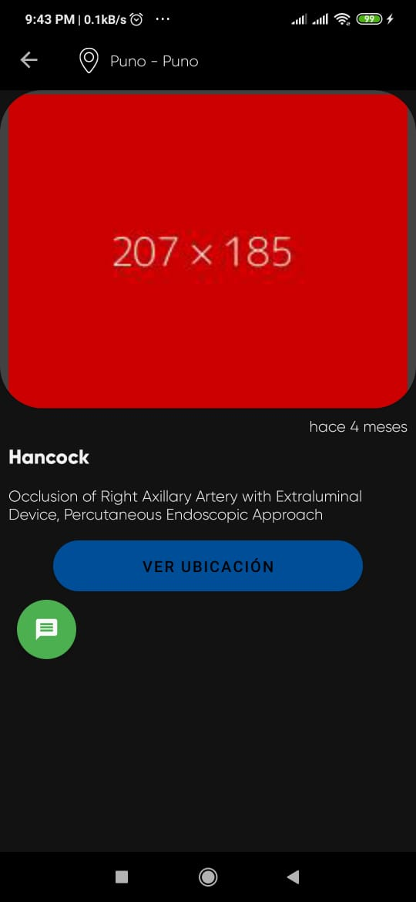
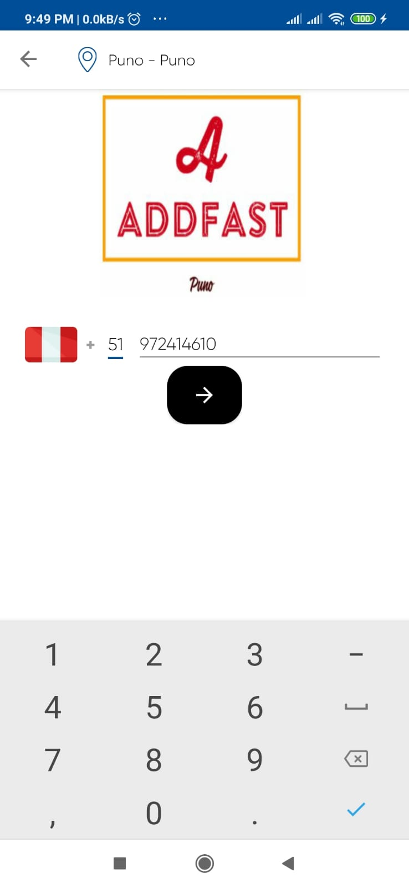
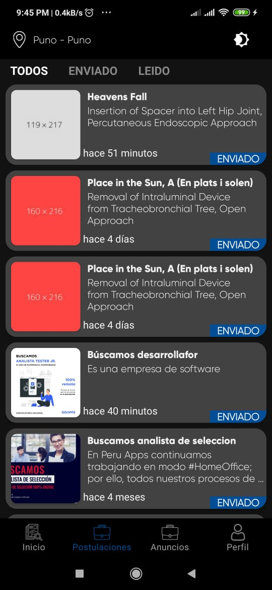
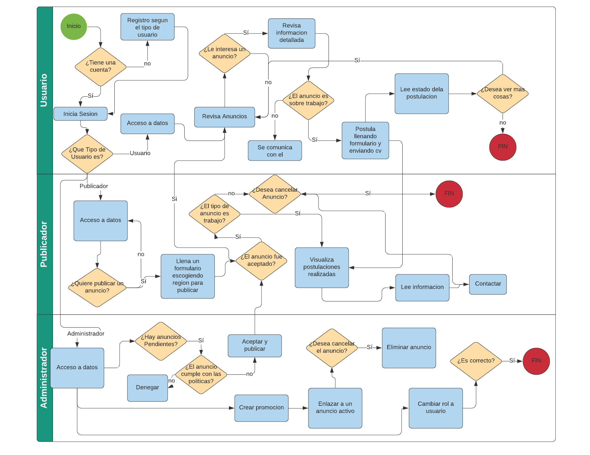
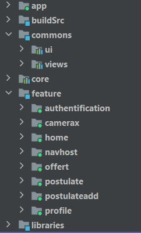
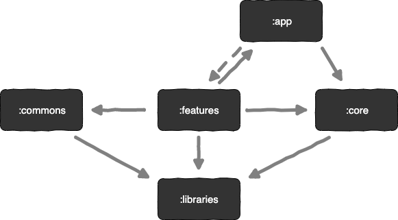
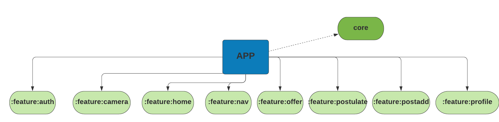

## Android Components Architecture 

### You can help me improve by giving me advice on my [LinkedIn!](https://www.linkedin.com/in/cesarwillymc/)

## Application mobile with theme dark and light

This application has the objective of containing basic things for a good architecture in android projects, this project will improve sequentially first by migrating the MVVM project to Modular Architecture.
This project is carried out in my National University of the Altiplano as a basic work, which I am refactoring to become a guide for android developers.
Any comment you can communicate with me through my Linkedin [CESAR](https://www.linkedin.com/in/cesarwillymc/)

In the proyect i used `Firestore`, `Bugsnack`, `Coroutines`, `Navigation Dynamic` and Others.

| Mode| Light| Dark| 
| ----- | ---- |---- | 
| HOME |  |  |
| CATEGORY |  |  |
| DETAIL ADD |  |  |
| PROFILE |  |  |
| AUTH |  |  |
| AUTH CODE |  |  |
| POSTULATE |  |  |
| MY ADDS |  |  |

## Flowchart

 

## Architecture

The architecture of the application is based, apply and strictly complies with each of the following 5 points:

-   A single-activity architecture, using the [Navigation component](https://developer.android.com/guide/navigation/navigation-getting-started) to manage fragment operations.
-   [Android architecture components](https://developer.android.com/topic/libraries/architecture/), part of Android Jetpack for give to project a robust design, testable and maintainable.
-   Pattern [Model-View-ViewModel](https://en.wikipedia.org/wiki/Model%E2%80%93view%E2%80%93viewmodel) (MVVM) facilitating a [separation](https://en.wikipedia.org/wiki/Separation_of_concerns) of development of the graphical user interface.
-   [S.O.L.I.D](https://en.wikipedia.org/wiki/SOLID) design principles intended to make software designs more understandable, flexible and maintainable.
-   [Modular app architecture](https://proandroiddev.com/build-a-modular-android-app-architecture-25342d99de82) allows to be developed features in isolation, independently from other features.

### Modules

Modules are collection of source files and build settings that allow you to divide a project into discrete units of functionality. In this case apart from dividing by functionality/responsibility, existing the following dependence between them:

 

The above graph shows the app modularisation:
-   `:app` depends on `:core` and indirectly depends on `:features` by dynamic-features.
-   `:features` modules depends on `:commons`, `:core`, `:libraries` and `:app`.
-   `:core` and `:commons` only depends for possible utils on `:libraries`.
-   `:libraries` don’t have any dependency.

#### App module

The `:app` module is an [com.android.application](https://developer.android.com/studio/build/), which is needed to create the app bundle.  It is also responsible for initiating the [dependency graph](https://github.com/google/dagger), [play core](https://developer.android.com/reference/com/google/android/play/core/release-notes) and another project global libraries, differentiating especially between different app environments.

 

#### Core module

The `:core` module is an [com.android.library](https://developer.android.com/studio/projects/android-library)  for serving network requests or accessing to the database. Providing the data source for the many features that require it.

 

#### Features modules

The `:features` module are an [com.android.dynamic-feature](https://developer.android.com/studio/projects/dynamic-delivery) is essentially a gradle module which can be downloaded independently from the base application module. It can hold code and resources and include dependencies, just like any other gradle module.

#### Commons modules

The `:commons` modules are an [com.android.library](https://developer.android.com/studio/projects/android-library) only contains code and resources which are shared between feature modules. Reusing this way resources, layouts, views, and components in the different features modules, without the need to duplicate code.

#### Libraries modules

The `:libraries` modules are an [com.android.library](https://developer.android.com/studio/projects/android-library), basically contains different utilities that can be used by the different modules.

### Architecture components

Ideally, ViewModels shouldn’t know anything about Android. This improves testability, leak safety and modularity. ViewModels have different scopes than activities or fragments. While a ViewModel is alive and running, an activity can be in any of its lifecycle states. Activities and fragments can be destroyed and created again while the ViewModel is unaware.

Passing a reference of the View (activity or fragment) to the ViewModel is a serious risk. Lets assume the ViewModel requests data from the network and the data comes back some time later. At that moment, the View reference might be destroyed or might be an old activity that is no longer visible, generating a memory leak and, possibly, a crash.

The communication between the different layers follow the above diagram using the reactive paradigm, observing changes on components without need of callbacks avoiding leaks and edge cases related with them.
## Authors

**Cesar Mamani**

