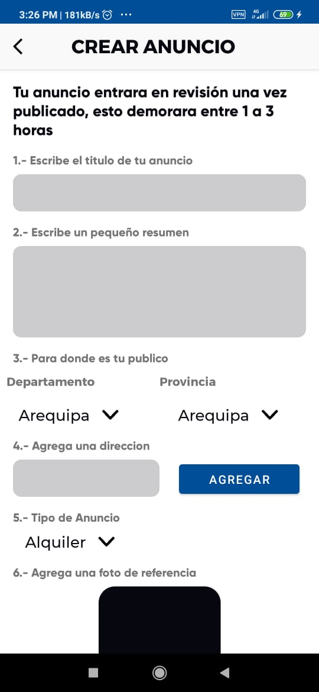
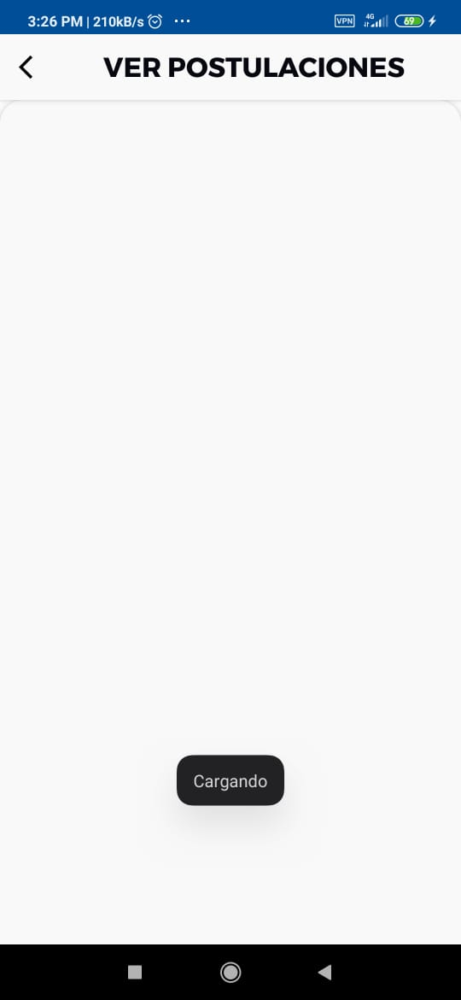
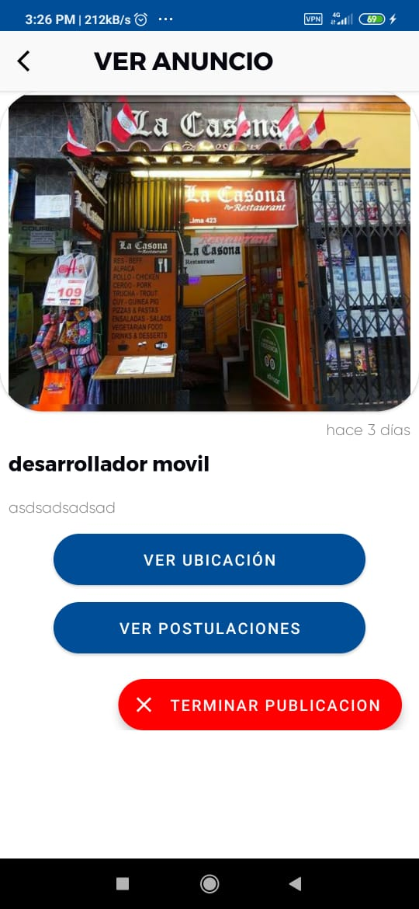
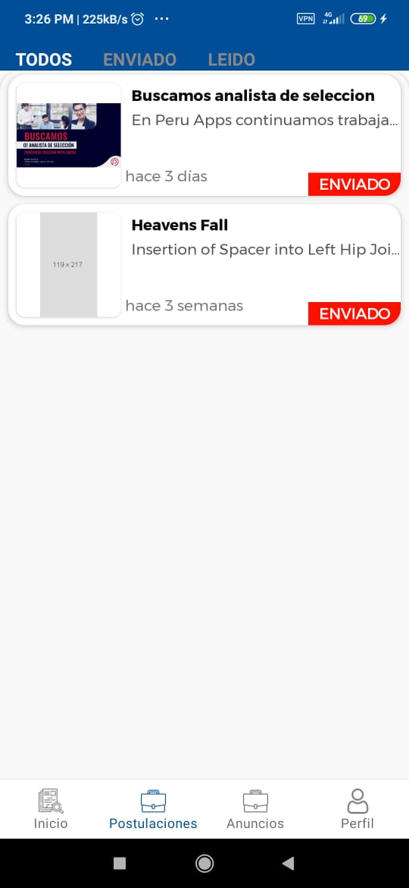
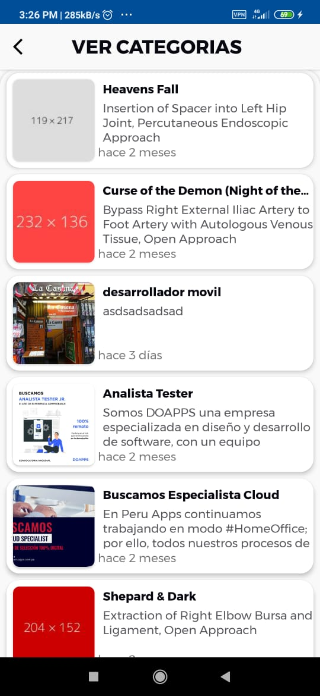
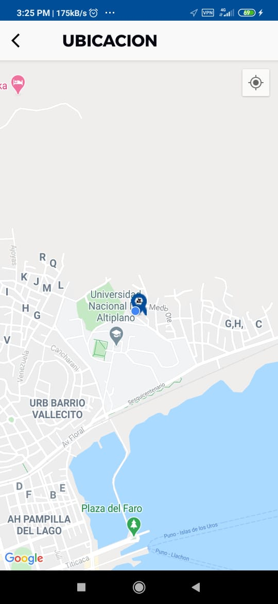
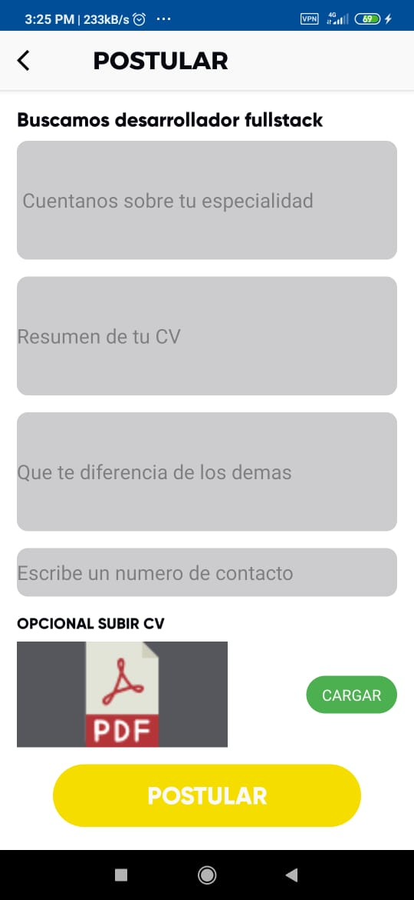
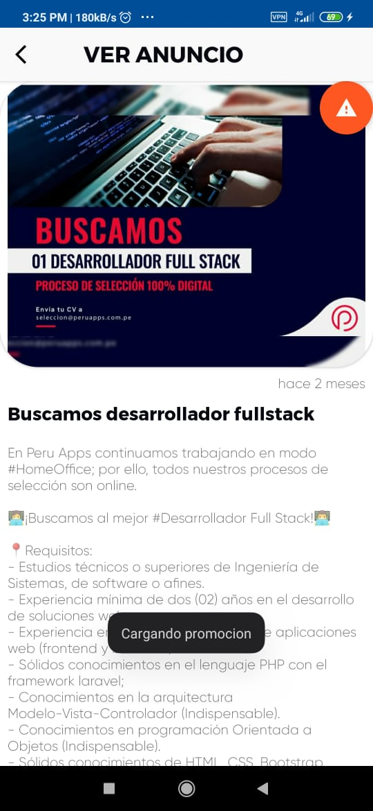
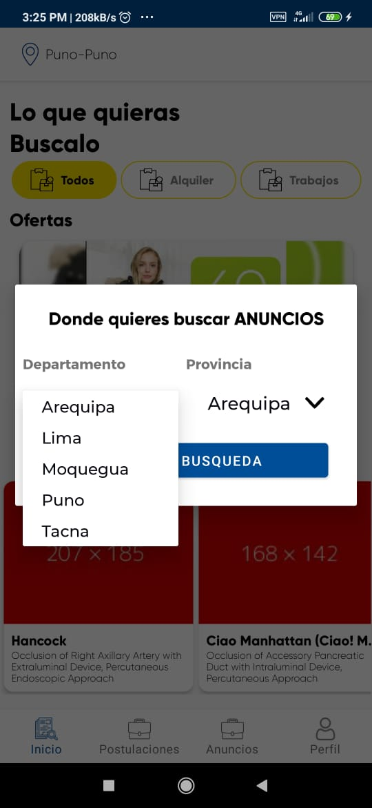
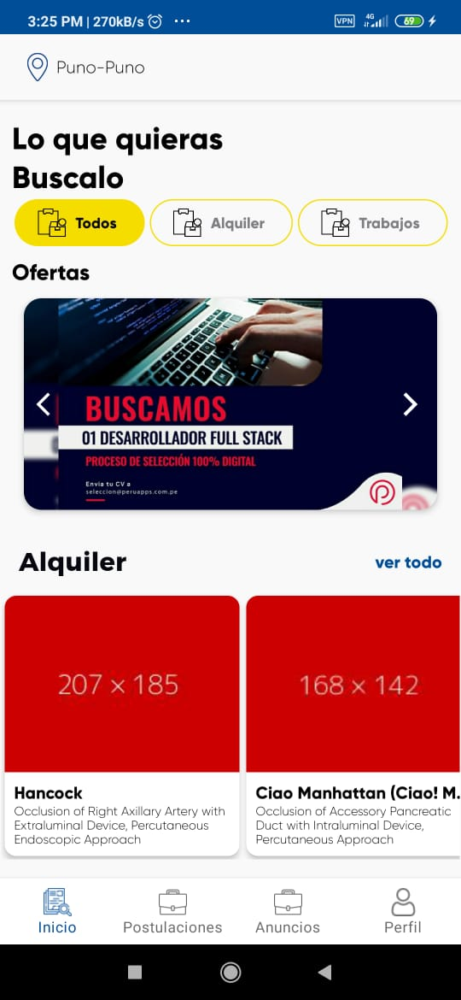

# ADD FAST

## Gestion de anuncios 
git

La arquitectura usada es de MVVM

## Ejecucion del Proyecto

Primero debe sincronizar su proyecto con firebase y cambiar el nombre del paquete

descargar las librerias.

Enlazar Huawei identity para mensajes de texto.

## Estructura

La siguiente arquitectura a mostrar sigue los estándares de la arquitectura basada en capas:

### App

Inicializamos la aplicacion con kodein

### Base

Base de las actividades y fragments

### Repo 
Es la conexcion de la aplicacion con los servicios Api que se usan en este caso Firebase y Huawei
#### Conexion
Estaran las funciones de conexcion con firebase
#### Local
Estara la conexcion la la base de datos local
#### Model
Estaran todos los POJOS del aplicativo

### UI
estaran todas las interfaces del  usuario separadas por los usos 

#### Auth
Vista de autentificacion para mensajes de texto

#### Camera
Vista  que gestioan la obtencion de imagenes por archivos o toma de fotos con camerax

#### Main 

Main contiene las vistas de Administrador, services, y usuario

### UTILS

Contiene todas las funciones de uso constante
 
 
 ## Imagenes
 

 ## Creador
 
 CREADOR: CESAR WILLY MAMANI CANAZA
  ## Correo
 CORREO: CESARWILLY@GMAIL.COM
  ## Redes
 LINKEDIN: CESARWILLYMC

