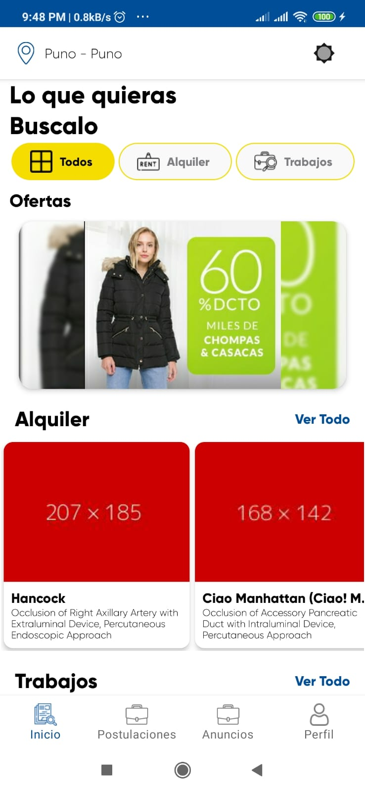
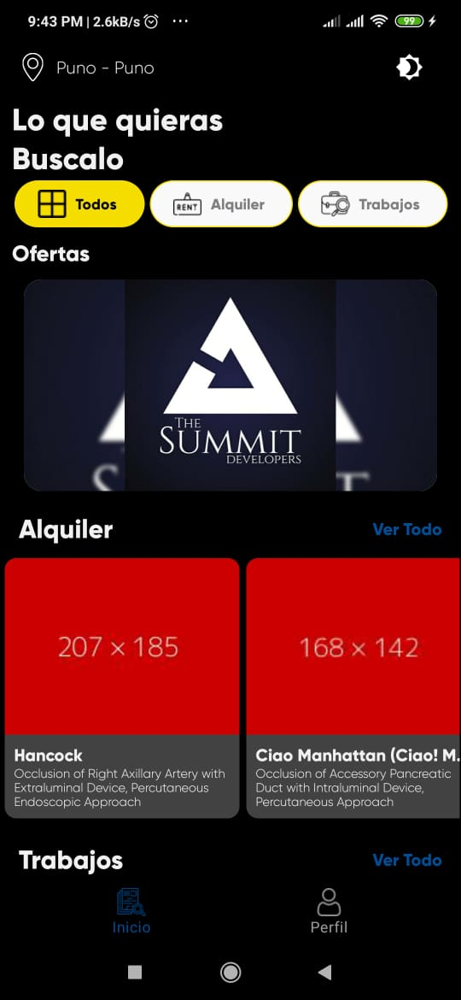
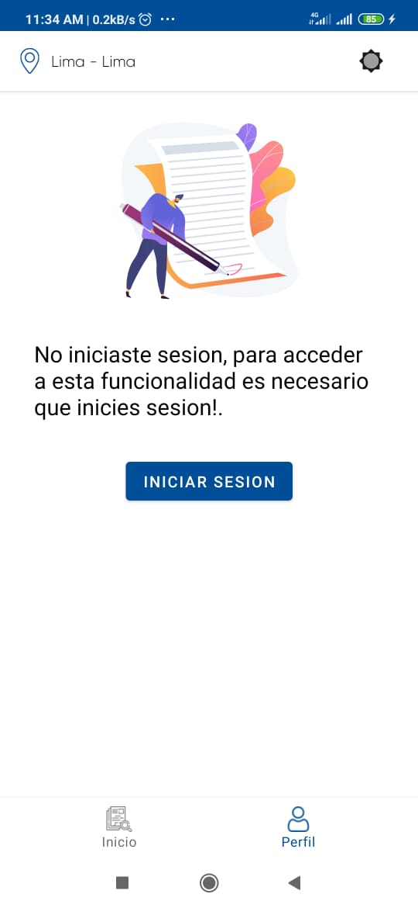
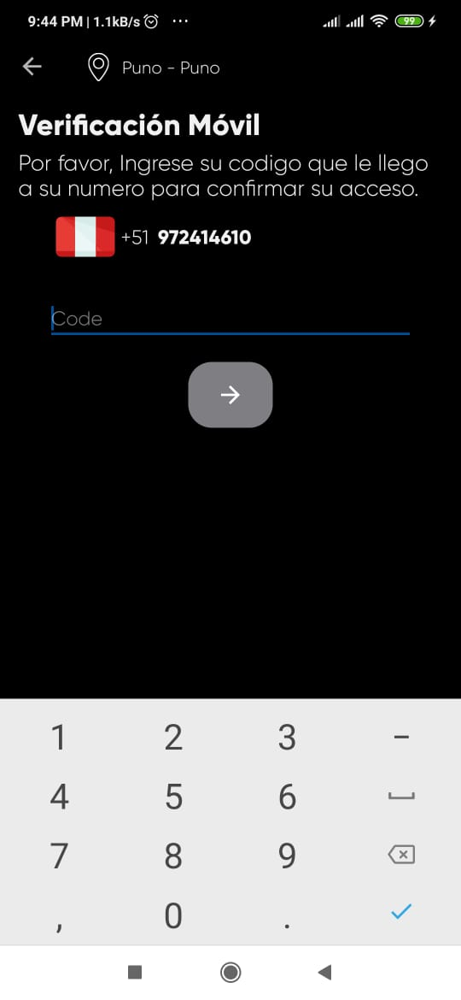
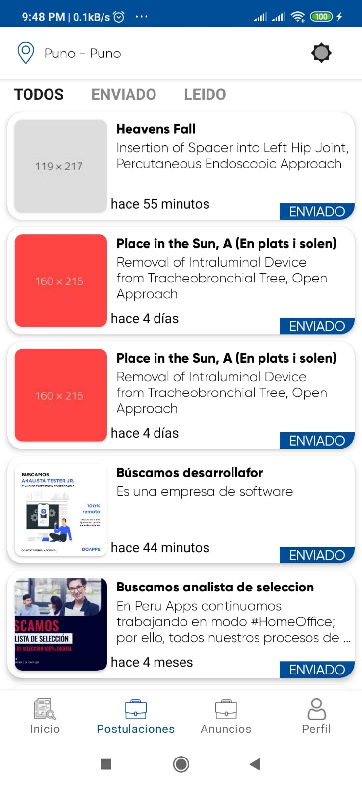

## Android Components Architecture in a Modular Word

## Application mobile with theme dark and light

| Mode| Light| Dark| 
| ----- | ---- |---- | 
| HOME |  |  |
| CATEGORY |  |  |
| DETAIL ADD |  |  |
| PROFILE |  |  |
| AUTH |  |  |
| AUTH CODE |  |  |
| POSTULATE |  |  |
| MY ADDS |  |  |

## Ejecucion del Proyecto

Primero debe sincronizar su proyecto con firebase y cambiar el nombre del paquete

descargar las librerias.

Enlazar Huawei identity para mensajes de texto.

## Estructura

La siguiente arquitectura a mostrar sigue los estándares de la arquitectura basada en capas:

### App

Inicializamos la aplicacion con kodein

### Base

Base de las actividades y fragments

### Repo 
Es la conexcion de la aplicacion con los servicios Api que se usan en este caso Firebase y Huawei
#### Conexion
Estaran las funciones de conexcion con firebase
#### Local
Estara la conexcion la la base de datos local
#### Model
Estaran todos los POJOS del aplicativo

### UI
estaran todas las interfaces del  usuario separadas por los usos 

#### Auth
Vista de autentificacion para mensajes de texto

#### Camera
Vista  que gestioan la obtencion de imagenes por archivos o toma de fotos con camerax

#### Main 

Main contiene las vistas de Administrador, services, y usuario

### UTILS

Contiene todas las funciones de uso constante
 
 
 ## Imagenes
 

  ## Redes
 LINKEDIN: CESARWILLYMC

